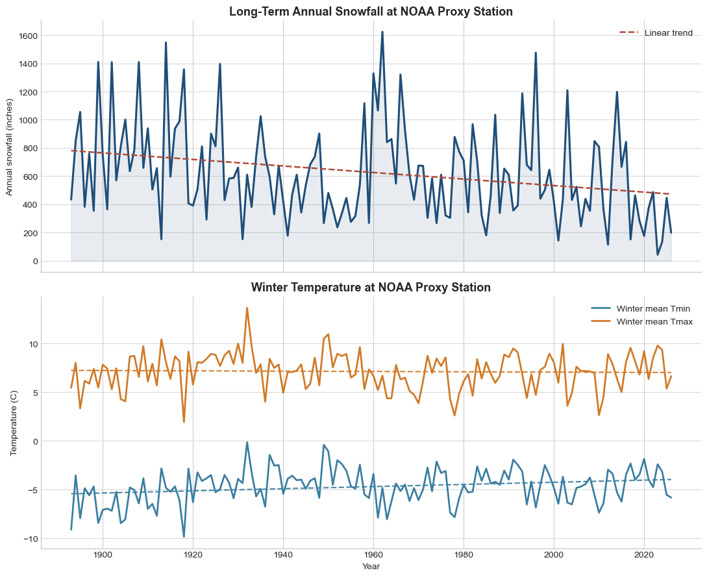
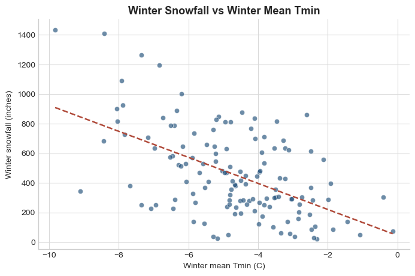
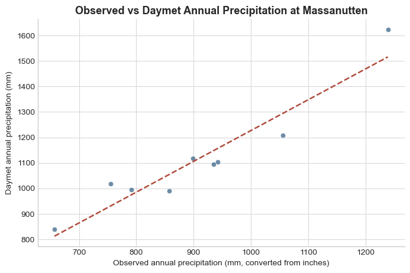
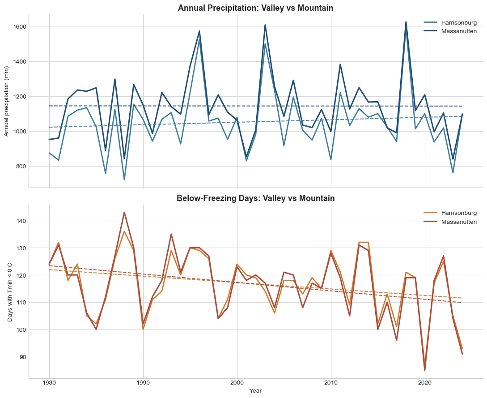
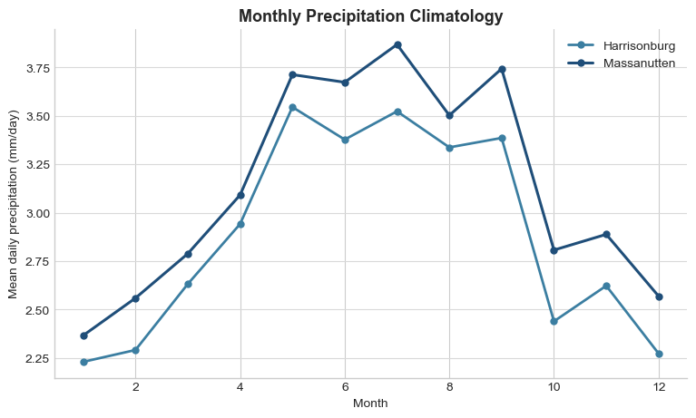

# Daymet Massanutten Workflow Figures Draft

This draft gathers the main figures from the `Daymet_Massanutten_Workflow.ipynb` notebook and gives each one a short caption. Long-term snow conditions appear to be becoming less favorable, and the Daymet comparison helps place recent Massanutten conditions into a broader mountain-versus-valley climate context.

## Figure 1. Long-Term Snowfall and Winter Temperature at the NOAA Proxy Station

Caption:
This figure introduces the long-term climate story by pairing annual snowfall totals with winter temperature at the Dale Enterprise NOAA proxy station. The snowfall panel suggests a general decline over time, while the winter temperature panel shows a gradual warming signal. Together, these two panels set up the central project question: if winters are warming, are snow conditions around Massanutten becoming less reliable?

## Figure 2. Winter Snowfall vs Winter Mean Minimum Temperature

Caption:
This scatter plot follows directly from Figure 1 by testing the relationship between winter snowfall and winter minimum temperature. The negative slope suggests that warmer winters tend to coincide with lower snowfall totals. This matters because it links the observed long-term warming signal to a likely physical explanation for declining snow reliability.

## Figure 3. Observed vs Daymet Annual Precipitation at Massanutten

Caption:
After establishing the long-term snowfall pattern, this figure checks whether Daymet is reasonable to use as a longer-term climate reference near Massanutten. The comparison between observed annual precipitation and Daymet annual precipitation shows whether the gridded product tracks the local station well during the overlap period. If the relationship is fairly strong, that supports using Daymet to extend the climate analysis beyond the short local record.

## Figure 4. Valley vs Mountain Annual Comparison

Caption:
With Daymet serving as a broader climate context, this figure compares Harrisonburg in the valley to Massanutten on the mountain across the longer record. The upper panel examines whether the mountain tends to receive more annual precipitation, while the lower panel compares the number of below-freezing days. These comparisons help show why elevation matters for snow conditions: even if the whole region is warming, the mountain may still remain colder and potentially more favorable for snow than the valley.

## Figure 5. Monthly Precipitation Climatology

Caption:
The final figure shifts from long-term trend to seasonal timing. Instead of showing a single year, it shows the average monthly precipitation cycle for Harrisonburg and Massanutten. This helps explain when precipitation typically peaks and how that seasonal pattern differs between the valley and mountain. In combination with the earlier temperature and freezing-day figures, this plot helps interpret not just how much precipitation falls, but when conditions are most likely to support snowfall.

